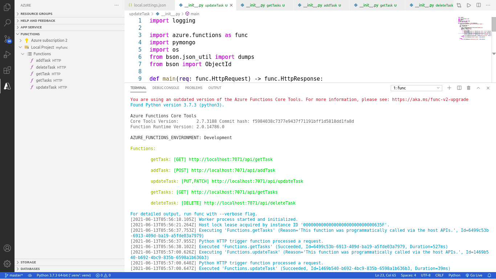

# REST APIs with Azure functions

Implementation of basic REST APIs with Azure functions and MongoDB using Python.
Four separate HTTPTrigger functions are created to store, retrieve and manipulate the data in Mongo Database through HTTP Get, Post, Put/Patch and Delete requests.

## Dependencies

1. Azure functions: func tools CLI and VScode extension
2. MongoDB: Azure CosmosDB or Local Connection
3. Python dependencies stored in the requirements.txt file. To install them, run `pip install -r requirements.txt`
4. Postman

## Demo
### App
`func start`

___
### POST Request - addTask

___
### GET Request - getTask

___
### GET Request - getTasks

___
### PUT Request - updateTask

___
### PATCH Request - updateTask

___
### DELETE Request - deleteTask

